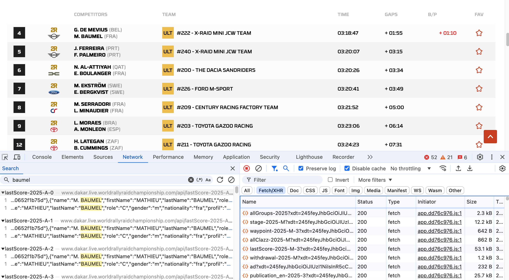

# The Dakar Rally Websites

The official Dakar Rally website — [https://www.dakar.com/en/rankings](https://www.dakar.com/en/rankings) — provides general rankings, as well as stage classifications, at the end of each stage. The data is "baked in" to the website HTML, the code that defines the webpage, as part of the HTML code.

The site also provides a link to a "live" results service — [https://www.dakar.live.worldrallyraidchampionship.com/en/car/standings](https://www.dakar.live.worldrallyraidchampionship.com/en/car/standings) — that also  receives updates *during* a stage, with rankings and timings provided at each waypoint.

The live results service displays the timing and results data, as you might imagine, via an HTML web page. But in this case, the data is supplied to the page via a data feed. The contents of the data feed are then processed and added to to the web page as the data is updated. So how can we identify the existence, and location, of an such data feeds?

All the major web browsers include within them a set of "developer tools". The original web was built on principles of openness and transparancy, with raw HTML delivered to the browser, which then rendered it to provide the visual web page display. The HTML code was, and continues to be, open to inspection by other web developers. This means that if you have ever wondered how a website manages to achieve a particular visual or functional trick, you can in principle look at the code to find out how it does it.

In the Chrome browser, the developer tools can be found from the `View menu`; select `Developer` then `Developer Tools`. The tool suite provided is quite comprehensive, and allows you to inspect web elements that are rendered in the page, check browser storage to see that resources or assets are being stored by a page inside your browser, and inspect the network traffic, which is to say, all the files that are downloaded to your browser when you visit a website.

```{admonition} Visiting a web page
:class: dropdown

When you visit a web page by providing a URL (a uniform resource locator), your browser will download that HTML page. The HTML file itself is a simple, single text file written using Hypertext Markup Language. But that single file will typically also be responsible for initiating the download of content and assets made up from a wide range of additional files and file types.

For example, each image in a page will typically be downloaded as a separate image file; as will each audio or video asset. Code for styling a web page using CSS (cascading style sheets) will typically be downloaded as one or more `.css` files.

Many web pages include interactivity that is managed using Javascript code, and again, the original HTML page will often set of a chain of actions that involves the loading of one or maore javascript files that may then in turn request the download of other additional files.

As well as assets relating to the page itself, many web pages also include trackers, advertising assets, and reporting functions for third part web analytics services. And once again, the original HTML page will initiate the downloading of all these additional resources.

```

If we have a look at the Dakar Live website from the network tab in developer tools as we load a stage results page, we see a wide range of files being loaded.

Inspecting them all to see what they contain might take us a very long time, but we can use a simple search tool to see whether there are any files in particular that contain particular pieces of information, such as the name of a particular crew member, for example:



In this case, we see that the name `baumel` appears in a several files with a filename constructed using the form `lastScore-2025-A-0`, `lastScore-2025-A-1` and so on.

Filtering the list of files in the network tab using the `Fetch/XHR` selector, we can see a whole host of files of this type being loaded by the page.

```{admonition} `Fetch/XHR` web/network traffic
:class: seealso

`XHR` is short for `XMLhttpRequest`, which is used to request data files. Viewing network traffic by `Fetch/XHR` type is often a shortcut to identifying files which may be loading __data__ into a page.
```

For example, other file names that might jump out at us include files with names of the form:

- `allGroups-2025`
- `stage-2025-M`
- `waypoint-2025-M-3`
- `allClazz-2025-M`
- `withdrawal-2025-M`
- `category-2025`
- `lastScore-2025-A-2`

If we scroll down, we note that many of these files reoccur, although with different suffixes (`?xdt=LONG_STRING_OF_CHARACTERS`; if you look closely enough, you will see these differ towards the end of the character string). This shows the page repeatedly loading the file to get the latest version of it, as befits a live data service page. The long string of characters after the `?` on the file name is a unique parameter value that prevents the file being "cached" and ensires that we keep getting the latest version of it.

```{admonition} Browser cacheing
:class: dropdown

To try to reduce the amount of data that gets downloaded to a web browser by a web page, browsers make use of "cacheing". When a file is cached, a local copy is kept. If that file is requested again, the browser will check to see if it already has a (recent) copy of it available locally; if it does, the browser will reuse that locally cached copy, rather than downloading another copy of it.

Note that cacheing applies at a domain level (for example, `www.dakar.com`). This means that one website (or domain) can't force a compromised file with a particular filename to be used by another website as the cached copy. For example, the file `data.txt` will be separately cached from `example1.com/data.txt` and  `example2.com/data.txt`, once for each domain. If `example1.com` makes a repeated request for the file `data.txt` it will get the copy of the cached file downloaded from the domain `example1.com`.

Sometimes, however, we *don't* want the browser to use a cached copy of a file. In a live results service, for example, we don't want to keep checking a previously downloaded version of a file, which may contain outdated or stale information from an hour ago. Instead, we may use a "cache busting" technique of creating a unique page request address each time we request the file by adding random characters to the resource identifier that may be ignored by the webserver that is delivering the resource. For example, my browser might see me request `example1.com/data.txt?junk=1234` and then follow it with `example1.com/data.txt?junk=6789`. The requested resources `data.txt?junk=1234` and `data.txt?junk=6789` are different (the `?junk=` component differs in each case), so no cacheing is applied. But as far as the server at `example1.com` is concerned, it might strip away the `?junk=` component, and keep on just returning the latest version of the file `data.txt`.
```

To return to the resources being downloaded from the Dakar live results page, we see that there are several resources that look like they might contain particular sorts of data - infromation about `waypoints` for example, or `withdrawals`. We might also notice some degree of strucure in the file names, including a date/year component (`2025`), a category, perhaps (`-M`, for example), and perhaps even a stage number (`-3`).

So let's take a closer look at the content of some of those files and see what we can find.